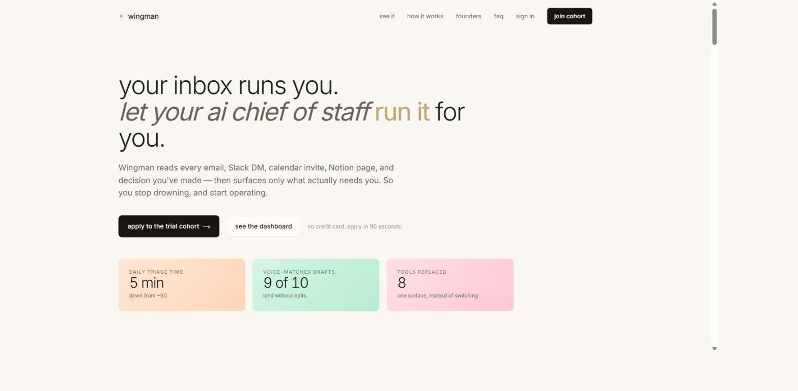

# Wingman

[wingman live](https://project-wingman-pi.vercel.app)

An AI chief of staff for founders and operators. It reads what comes in across Gmail and Slack, surfaces the few things that matter, drafts routine replies in your voice, and runs your daily and weekly cadence.

Working title. Built solo.

## What it does

- **Inbox triage.** Classifies incoming Gmail and drafts replies in the user's voice.
- **Slack ingestion.** Pulls channel history on a cron and finds commitments, things you said you would do and things others said they would do.
- **Daily signal, evening reflection, weekly digest.** A cadence that runs itself.
- **Audio briefing.** A text-to-speech digest for when reading is the wrong format.
- **Decisions log and contact memory.** Context that compounds across sessions.

## Stack

Next.js App Router, TypeScript, Supabase, Clerk for auth and OAuth token handling, Vercel. Cron jobs for ingestion.

## How it was built

Full write-up: [AGENT_PROTOCOL.md](AGENT_PROTOCOL.md).

Two Claude instances working the same repo, coordinating through an append-only log at `coordination/log.md`.

One instance ran as Claude Code in the terminal: writes code, runs tests, commits, pushes, deploys. The other ran in Cowork on the desktop: writes specs, drives strategy, verifies in the browser, queues the next batch. Each reads the log at the start of every turn and appends when it acts. Neither edits the other's entries.

When either one needs a human, it ends its entry with `@AJIT:` and stops. That is the whole escalation protocol. My job most days was typing `check log` in each window.

The protocol is in `coordination/log.md` if you want to copy it.

## Repo map

| File | What it holds |
|---|---|
| `CONVENTIONS.md` | Coding and integration rules both agents follow |
| `ROADMAP.md` | Product versions and scope |
| `MH_UI_SPEC.md` | Interface spec |
| `OAUTH_VERIFICATION.md` | Google OAuth verification working notes |
| `PRIVACY_POLICY.md` | Written for real users, in plain language |
| `coordination/log.md` | The two-agent message bus |

## Status

v0, built against real integrations, no mocks. Google OAuth flow implemented for Gmail, Slack OAuth for channel ingestion.

## Author

Ajit Nayak. [linkedin.com/in/ajit-nayak](https://linkedin.com/in/ajit-nayak)
